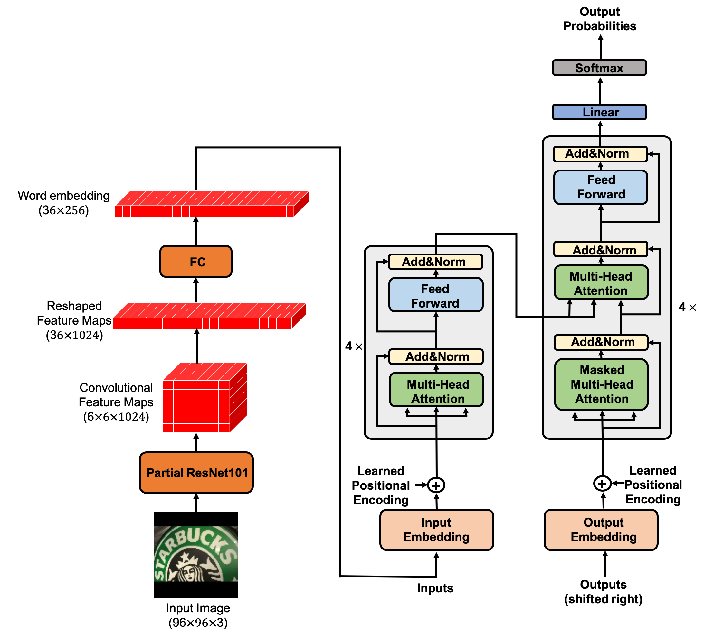
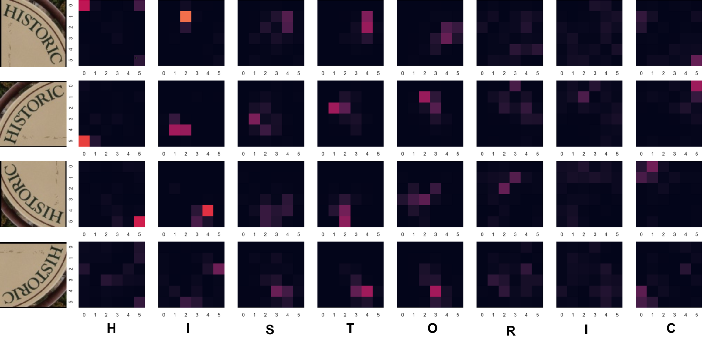

# Dataset for train

[SynthText in the Wild Dataset](https://www.robots.ox.ac.uk/~vgg/data/scenetext/)

you'll have to create the dataset by yourself,

You can do so by following these steps:

1. Get the data and put it into a directory (lets assume we put the data into the directory /data/oxford)
2. run the script crop_words_from_oxford.py (you can find it in /preparation dataset folder) with the following command line parameters python crop_words_from_oxford.py /data/oxford/gt.mat /data/dataset.
3. This will crop all words based on their axis aligned bounding box from the original oxford gt.
4. Create train and validation split with the script create_train_val_splits.py. python create_train_val_splits.py /data/dataset/list.txt.

# Dataset for test

[CUTE80](https://github.com/ocr-algorithm-and-data/CUTE80)

[SVT-Perspective](https://github.com/ocr-algorithm-and-data/SVT-Perspective)

[ICDAR 2015](https://rrc.cvc.uab.es/?ch=4&com=downloads) Task 4.3.

you need to change inside the gt.txt files the space with tab

I recommend to look in predict script to understand the dir structure,

    'SVT': 'eval/SVT-Perspective',
    'CUTE80': 'eval/CUTE80',
    'IC15': 'eval/IC15/images'
    
    

you also need to create checkpoint/ directory, after each epoch the script will save a model. 

you should notice that the requirements is for cpu, you need to change it.

# Author note
We realized that the code of computing loss is problemtic, which is directly borrowed from http://nlp.seas.harvard.edu/2018/04/03/attention.html#loss-computation. We are revising the code and conducting new experiments. To aovid misleading others, we have withdrawed the arXiv paper. We will decide whether submit a new paper to arXiv according to the new expermen

# Scene Text Recognition via Transformer
Implementation of Transformer OCR  as described at [Scene Text Recognition via Transformer](https://arxiv.org/abs/2003.08077).

## model architecture:

## Heat map of the source attention (encoder memory) score of the first layer of decoder:

## The transformer source code from:http://nlp.seas.harvard.edu/2018/04/03/attention.html
